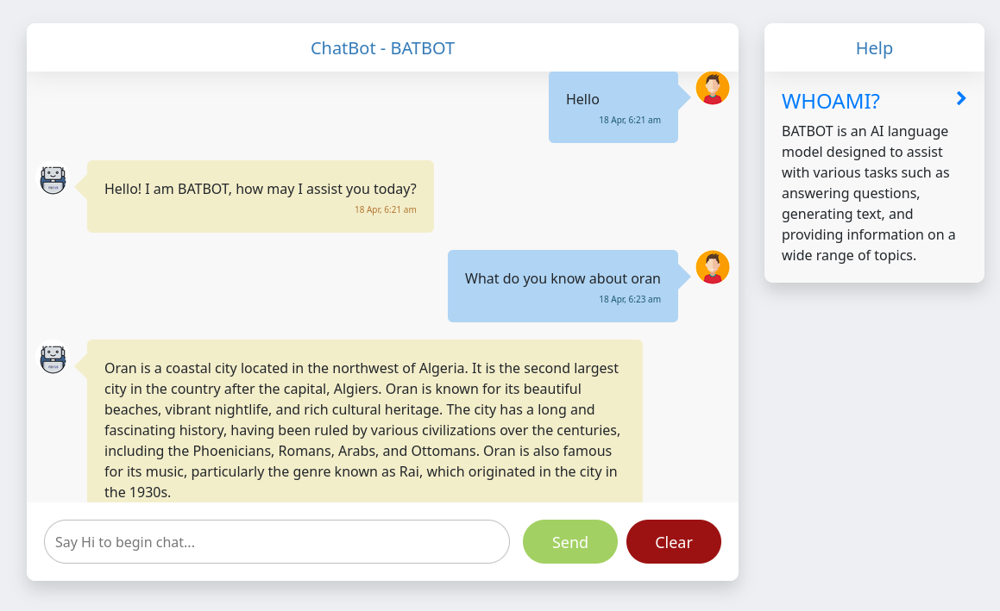

# BatBot ChatBot
- The chatbot can converse with users in natural language and respond to a wide range of queries. ## Getting Started To get started with BATBOT, you will need to have an OpenAI API key. 
- You can sign up for an API key on the OpenAI website. Once you have an API key, you can clone this repository to your local machine and install the required dependencies by running the following commands: ``` git clone https://github.com/<your-username>/batbot.git cd batbot pip install -r requirements.txt ``` 
- You will also need to set your OpenAI API key as an environment variable by running the following command: ``` export OPENAI_API_KEY=<your-api-key> ``` 
 
- 
## Usage 
- To start the BATBOT server, run the following command: ``` python app.py ``` 
- This will start the server on port 5000. You can access the chatbot by navigating to `http://localhost:5000` in your web browser. 
- To clear the chatbot's conversation history, you can navigate to `http://localhost:5000/clear_conversation`. 
## Contributing 
- If you would like to contribute to BATBOT, feel free to submit a pull request. 
- Before submitting a pull request, please make sure that
